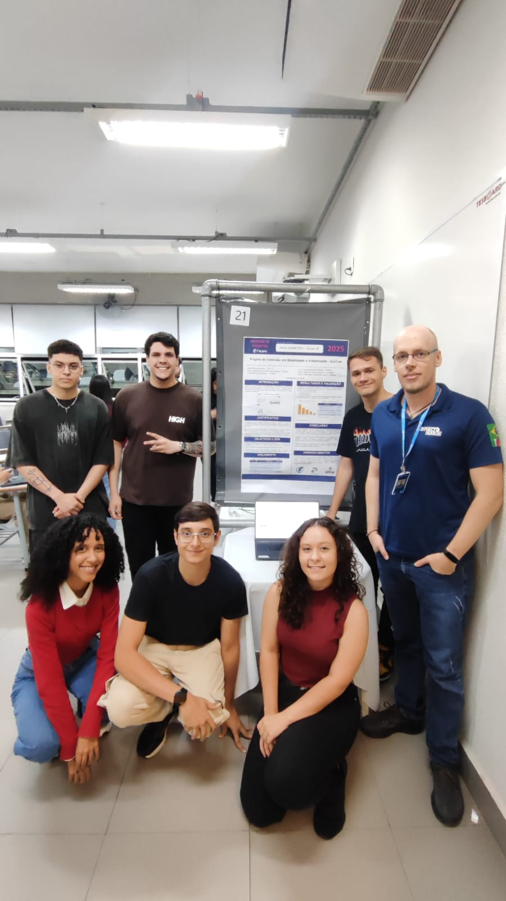
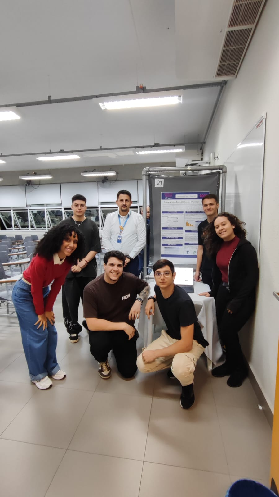

# Usina de Projetos Experimentais 4 - Grupo ODSCoders

Neste repositório você encontrará o projeto do 4º semestre da disciplina de UPX - 4 (Usina de Projetos Experimentais 4) do grupo **ODSCoders** da turma A de Análise e Desenvolvimento de Sistemas EAD do Centro Universitário Facens.

### Integrantes

* **João Gabriel Savioli** - RA: 247617
* **João Guilherme Azevedo de Almeida** - RA: 249229
* **Karla Alejandra Acosta Barrios** - RA: 249369
* **Lívia Moraes de Borba** - RA: 249595
* **Luiz Fernando Brisola** - RA: 249429
* **Otávio Henrique Fernandes Inácio** - RA: 248069

---

### Sobre o Projeto

O projeto **EcoTrek** é um aplicativo colaborativo e gamificado que une a conscientização ambiental com a melhoria da mobilidade urbana. Ele foi projetado para capacitar os cidadãos a se tornarem agentes de mudança em suas próprias comunidades, reportando problemas de infraestrutura.

O sistema é dividido em duas funcionalidades principais:

1.  **Mapa Colaborativo:** Uma plataforma onde os usuários podem reportar e visualizar problemas de mobilidade urbana, como buracos nas vias, falta de acessibilidade, ou pontos de ônibus sem abrigo.
2.  **Sistema de Gamificação:** Os usuários ganham pontos ao registrar reportes de problemas urbanos na infraestrutura geral da cidade. Os pontos podem ser trocados por benefícios ou simplesmente para acompanhar o impacto ambiental.

O **EcoTrek** está alinhado com importantes **Objetivos de Desenvolvimento Sustentável (ODS)** da ONU: **ODS 11** (Cidades e Comunidades Sustentáveis), **ODS 13** (Ação Contra a Mudança Global do Clima) e **ODS 3** (Saúde e Bem-Estar).

---

### Tecnologias Utilizadas

As seguintes tecnologias foram escolhidas para o desenvolvimento do projeto:

* **Frontend:** HTML, CSS, JavaScript
* **Backend:** Node.js, Express
* **Banco de Dados:** Firebase (Firebase Datastore)
* **API de Mapas:** Leaflet (Biblioteca JS)

---

### Acesso

Tanto o Front quanto o Back-end estão hospedados no Firebase.
Para acessar o website, acesse por um dos dois links abaixo:

**1.** https://ecotrek-802a6.web.app

**2.** https://ecotrek-802a6.firebaseapp.com

---

### Apresentação Presencial

O projeto foi devidamente apresentado no Centro Universitário Facens com todos os integrantes. A apresentação ocorreu no dia 19/11/2025 no período das 19:00 - 20:40.
O projeto foi apresentado para dois professores orientadores:

* **Fabrício Tonetto Londero** & **Eliney Sabino**

  
  

---

### Próximos Passos (Roadmap)

Este é um projeto experimental com potencial de crescimento. Os próximos passos incluem:

* **Funcionalidades Gamificadas:** Implementar um sistema de desafios semanais e rankings.
* **Integração com API de Dados Públicos:** Adicionar dados sobre qualidade do ar ou estatísticas de transporte público.
* **Expansão do Mapa:** Habilitar o reporte de problemas em mais cidades.
* **Versão Mobile:** Desenvolver um aplicativo nativo para Android e iOS.
